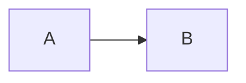

# Reading markdown

Markdown files open rendered rather than as source. The toggle in the file's toolbar switches
between the rendered document and its source, and the choice is remembered for every markdown file
you open afterwards.

Opening a file at a specific line — from a link in a message, for example — always opens the source,
because the line only exists there.

## Equations

Inline and display math render wherever markdown does, in files and in messages:

```markdown
Weights $w_i = \exp(\lambda t_i)$ decay with age.

$$Y_i \mid x_i \sim \mathcal{N}(\mu, \sigma^2)$$
```

Single `$` is only treated as math when it wraps an expression, so prices like `$5` are left alone.
An expression that is still being typed renders in red until it is complete, rather than blanking
the message around it.

## Diagrams

A fenced block tagged `mermaid` renders as a diagram:

````markdown

````

Use the toggle in the block's header to read the source instead. While an agent is still writing a
diagram, the source is shown — a half-written diagram cannot be drawn. If a diagram never parses,
the block stays as source; correcting the text renders it again.

## On mobile

The mobile app renders markdown, but not equations or diagrams. Both appear as source there. Opening
the same file in a browser — including a browser on your phone — renders them.
